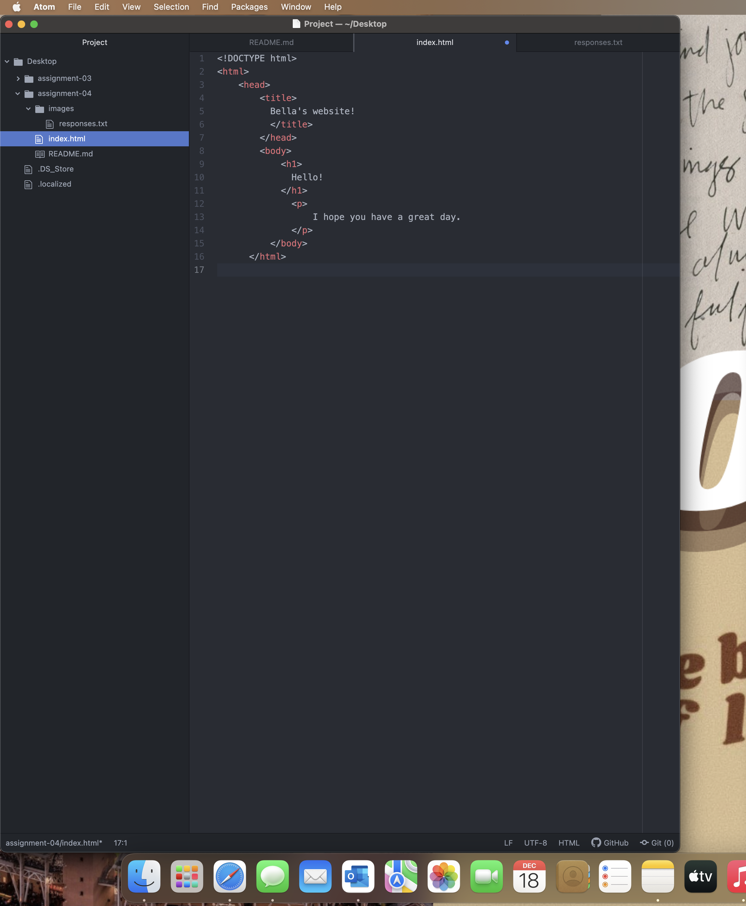

# Heading 1
Very briefly detail how browsers function. List any browsers you currently use to surf - or even develop for - the web.
      Browsers function by taking you to any point in the internet you may want to go. It will pick up different data parts from the web and it will appear via computer or phone. It provides an easy and sufficient way to look and interact with the web.  
Link to your screenshot using a relative URL. (We did this last week, too! Check your assignment-03 directory if you can't remember how you did it).  
      
