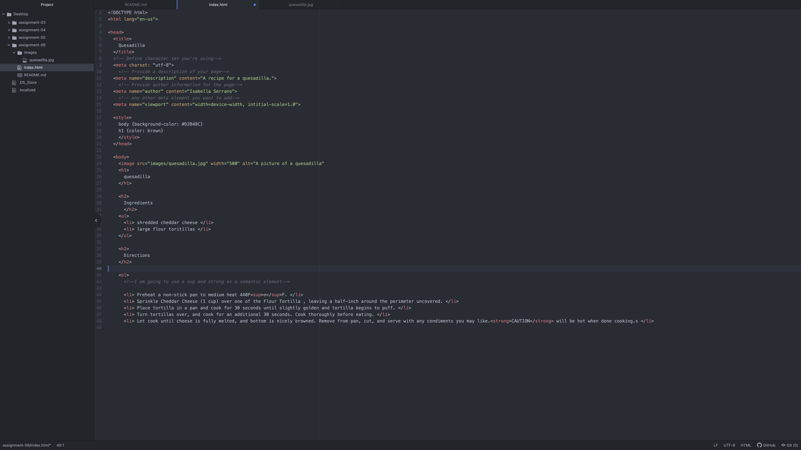

Please describe the difference between semantic and structural markup.
    Semantic markups will help provide information about its own functions using words, phrases and or textures. Structural markups provides information about the relationship between context in the document and the basics of the structure itself.
Link to screenshot within your README using a relative URL

