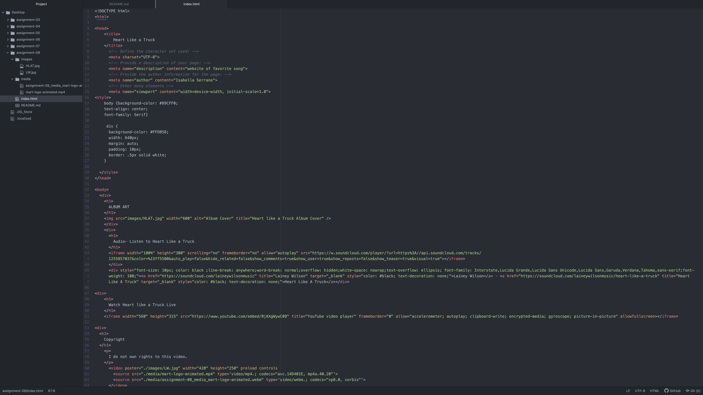

What is an affordance?
      An affordance is the assets an object may have. They are hints about the quality of an object and clarifies what it can be used for.
What are the advantages and disadvantages of using a third-party service like YouTube or Vimeo to host your videos?
      The advantages of using third party sites could be that it is mainly a free site, has a high attraction and user rate, can pull personal data and analytics on your videos and aid in branding or advance requirements. The disadvantages could consist of too large of a variability which can consist of inappropriate materials, the negative is easily shown and portrayed through comments, difficult to find specific topics and its difficult to build a following and earning.

  Link to screenshot of work
  
