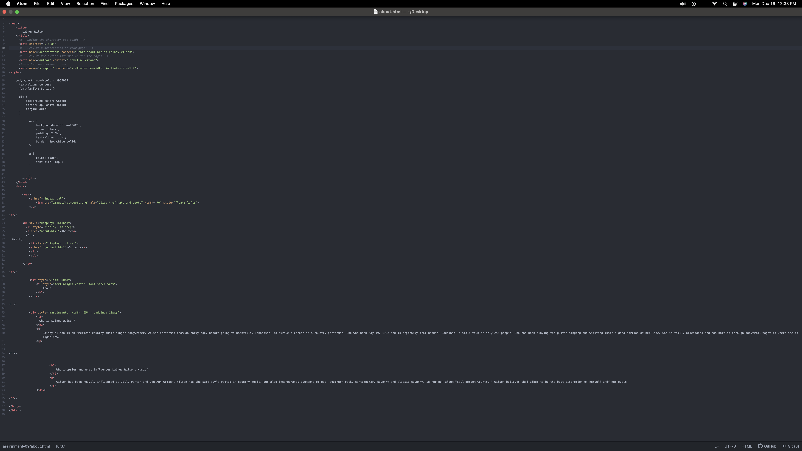
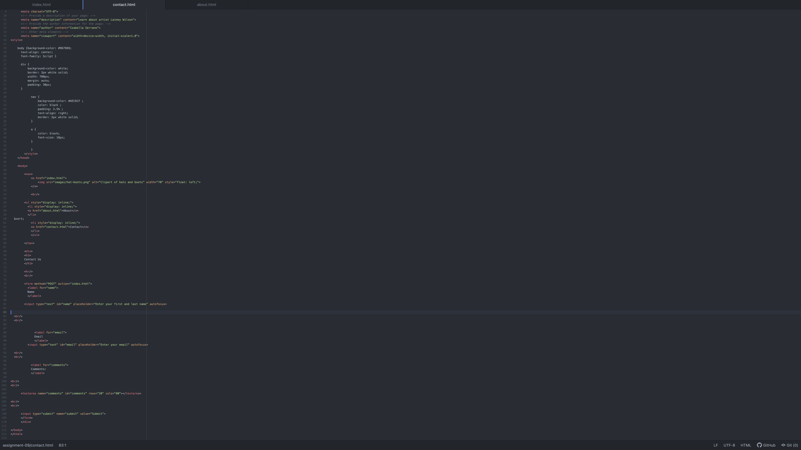
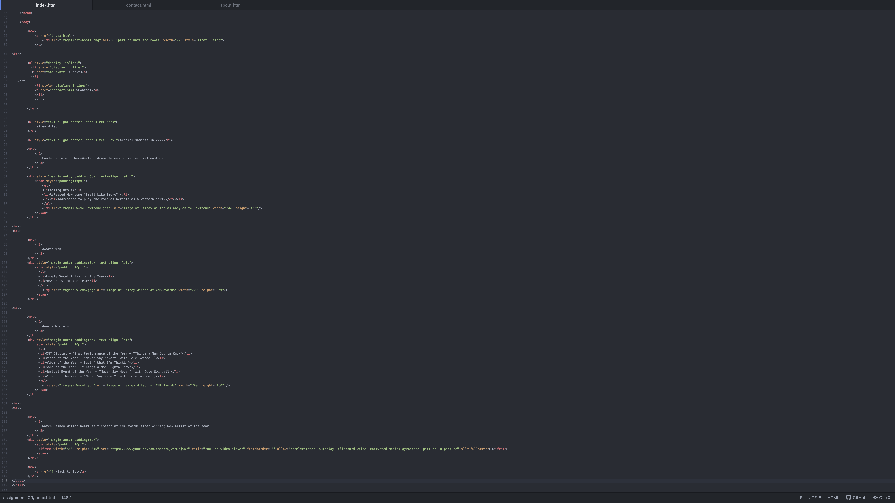

Briefly recap your experience learning HTML. What was old, new, interesting, or difficult to learn?
      My overall experience with html was fun. it was cool to see ourselves build a basic format website from the ground up. I really enjoyed adding style and my own personal touches. I am still struggling with the metas and understanding the concepts of comments. Overall, super excited to start decorating and learning more.
Next week we will be diving into CSS and expanding on styling, which helps us "decorate" HTML. Is there anything you're anxious or excited to learn about in this new section?
      I am excited to learn how to personalize my website and specify it to my companies needs. I am nervous about putting together and remember all the correct forms of normal htmls.
Link to screenshot

