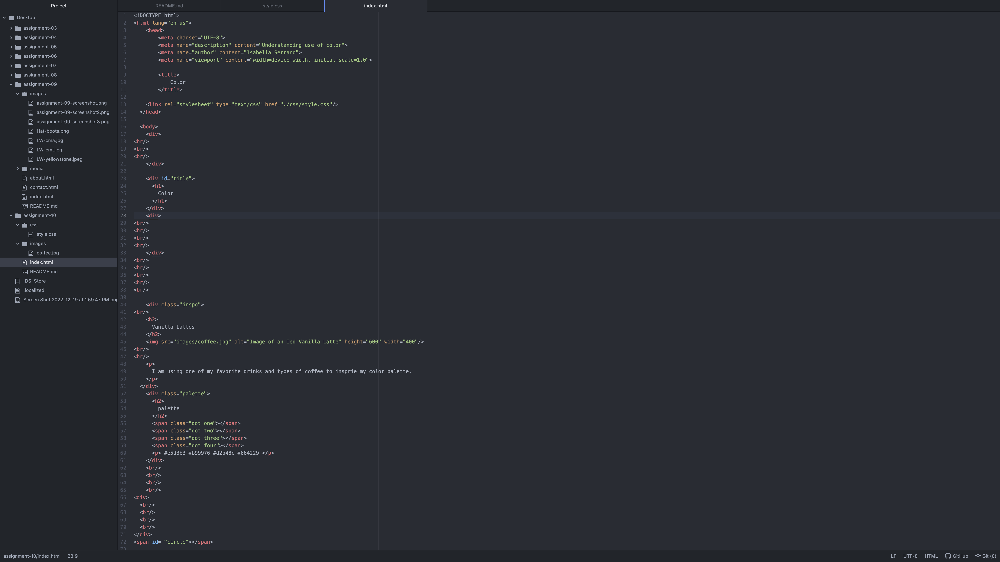

Describe the difference between the universal, element, class, and id selector types. When might you choose one over the other to style content?
The universal selector is used to style every element shown on a page with the indicator as a star *. The element selector is is used to select all elements of a certain type. You can use  selector by simply applying it to an element name. The class selector is used to select certain elements that could serve the same function and provide the same assets. the lat selector, ID selctor, is allows developers to define style rules for a specific element by calling its unique ID.
Discuss your color palette. How did you choose your colors?
I went witha tan and brown color scheme. I have always been attracted to neutral colors and I think they give off the most aesthetic look.
Link to screenshots

