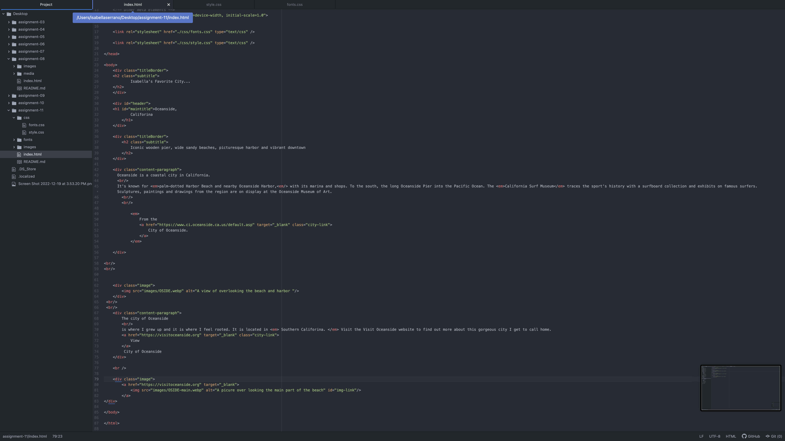
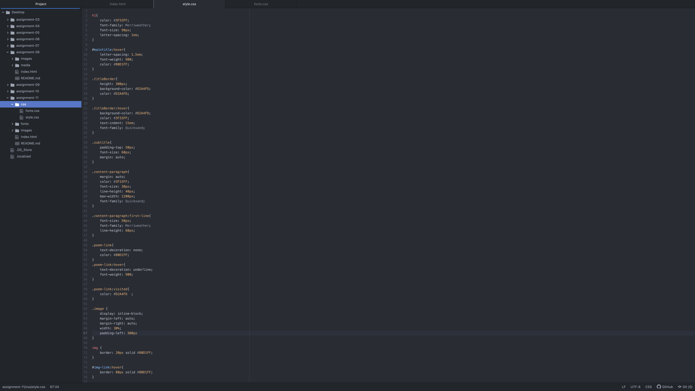
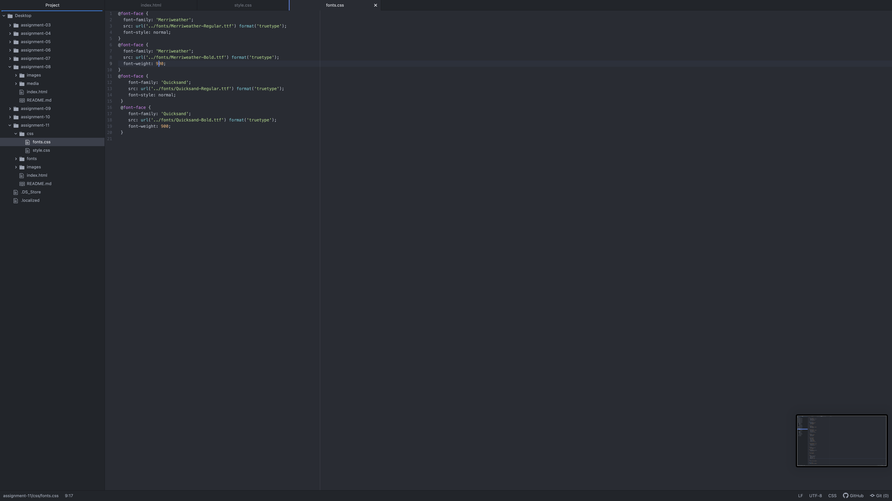

What is typography?
    Typography is a highly functional and useful skill for a designer. A typography is how you portray information you will be presenting to the user.
What is the importance of having fallback fonts or a font stack?
    It is important to have a fallback font or a font stack because when having a variety of users and browsers try to access your website, if for whatever reason your original font doesn't load, you have to have an option for the browsers to reload and try to use your fall backs or stacks.
What is the difference between a system font, web font, and web-safe font?
A system font is are fonts preloaded on your device or your systems. They are the most common and available fonts for users. A web font is are custom fonts provided via server. These might take a little extra work if they are needed. Lastly, a web-safe font is universal fonts developers can count on being available by the system.

Link to screenshots

